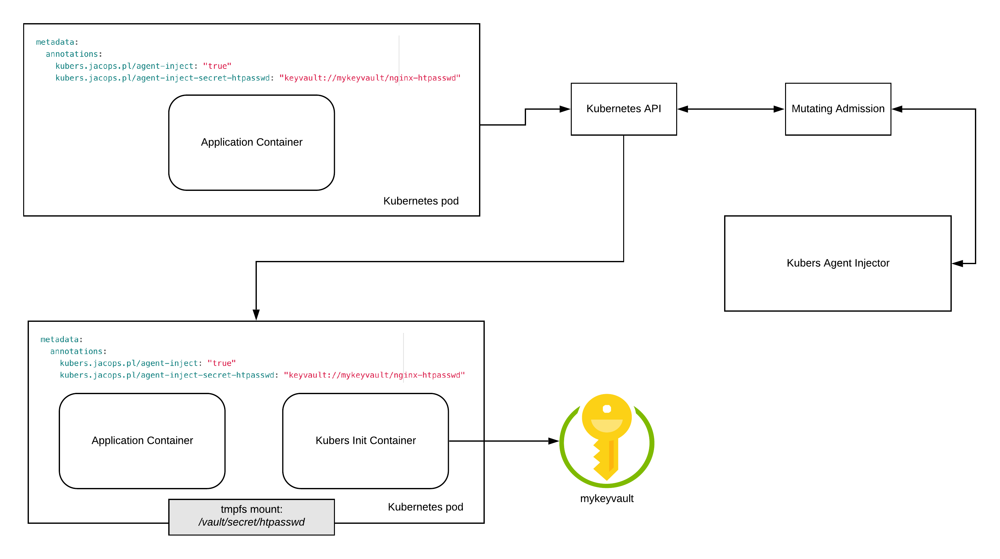

# Kubers - Kubernetes Remote Secrets
[](https://cloud.drone.io/jacops/kubers)


Kubers is a simple implementation of a SecOps pattern, where a sidecar or init container is responsible for retrieving secrets from services like Azure KeyVault and making them available to the user's application via shared memory volume.



## Supported drivers and services
* Azure (KeyVault)

## Installation
Use `kustomize` to install `kubers`:
```
kubectl apply -k git@github.com:jacops/kubers.git//deploy
```

## Usage

1. Enable agent injection by adding the following annotation:
   ```
   kubers.jacops.pl/agent-inject: "true"
   ```
2. Set agent driver by adding the following annotation:
  ```
  kubers.jacops.pl/agent-driver: "<azure-aws-or-other>"
  ```
  > This annotation can be optional if the driver is set globally in the `kubers` deployment.

3. To configure secret injection, please add the following annotation:

  ```
  kubers.jacops.pl/agent-inject-secret-<unique-name>: "<driver-name>://[<service-name>/]<key-name>"
  ```
  * `unique-name` - the filename of the rendered secret and must be unique if multiple secrets are defined by the user.
  * `driver-name` - Name of a driver used for retrieving the secret
  * `service-name` (optional) - Name of a remote service where the secret is stored.
  * `key-name` - Key name under which the secret is stored in the remote service.

  Deployment example:
  ```
  spec:
    template:
      metadata:
        annotations:
          kubers.jacops.pl/agent-driver: "azure"
          kubers.jacops.pl/agent-inject: "true"
          kubers.jacops.pl/agent-inject-secret-htpasswd: keyvault://examplekv/nginx-htpasswd
  ```

The secret should be available from the main container in `/vault/secret/<unique-name>`.

## Advanced Configuration

Below is a table containing other kubers annotations.

| Annotation | Description |
|---|---|
| `kubers.jacops.pl/agent-driver-azure-credentials-secret` | Secret with Azure credentials. See `Authentication` section for more info |
| `kubers.jacops.pl/agent-image` | Overrides a default docker image for an agent |
| `kubers.jacops.pl/secret-volume-path` | Specifies where the secrets are to be mounted after fetching. |
| `kubers.jacops.pl/secret-volume-path-<unique-name>` | Specifies where the `<unique-name>` secret is going to be mounted after fetching. |
| `kubers.jacops.pl/preserve-secret-case` | If enabled will preserve the case of secret name. By default the name is converted to lower case. |
| `kubers.jacops.pl/preserve-secret-case-<unique-name>` | If enabled will preserve the case of `<unique-name>` secret name. By default the name is converted to lower case. |


## Authentication

Every secret manager service requires a user to authenticate against. While this responsibility is offloaded from your application, the sidecar container still needs to do this.

Below is the guide on how to authenticate against different service providers.

### Azure
There are two ways to authenticate against Azure KeyVault. Service Principal and Managed Identity.

#### Managed Identity (recommended)
Using a system/user assigned identity has many benefits and in my opinion the main one is that you don't have to use any credentials and worry about secrets rotation.

To use Azure managed identities with your Kubernetes cluster, you need to install `AAD Pod Identity`: https://github.com/Azure/aad-pod-identity and assign some identities to pods as per instructions.

Obviously this will only work in AKS and AKS-engine based clusters.

#### Service Principal
This method requires you to create a service principal and a Kubernetes secret with the credentials, from which the sidecar container can authenticate itself against a KeyVault.

Using service principal is not recommended and should be only used in development or if you are in a non Azure environment.

To configure kubers agent to use service principal authentication, please add the following annotation to your pod:
```
kubers.jacops.pl/agent-inject-azure-credentials-secret: "<secret-name-of-the-sp-credentials>"
```

`secret-name-of-the-sp-credentials` secret should be structured as below:
```yaml
data:
  clientId: xxx
  clientSecret: xxx
  subscriptionId: xxx
  tenantId: xxx
```
> The agent injector supplies the sp credentials to the sidecar via environmental variables.
> While this is not the greatest method, it works well with `azure-sdk-for-go`. This however, can be refactored in the future.

## Examples

Please go to `examples` folder.

## Disclaimer
This repository is heavily inspired by https://github.com/hashicorp/vault-k8s.
Huge kudos to the Hashicorp folks for the work they have done around the Vault integration with Kubernetes.
